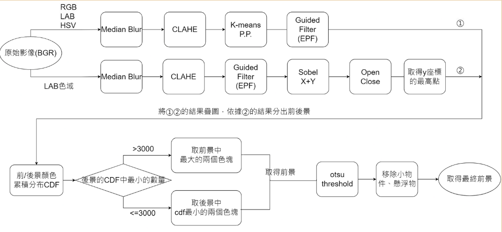
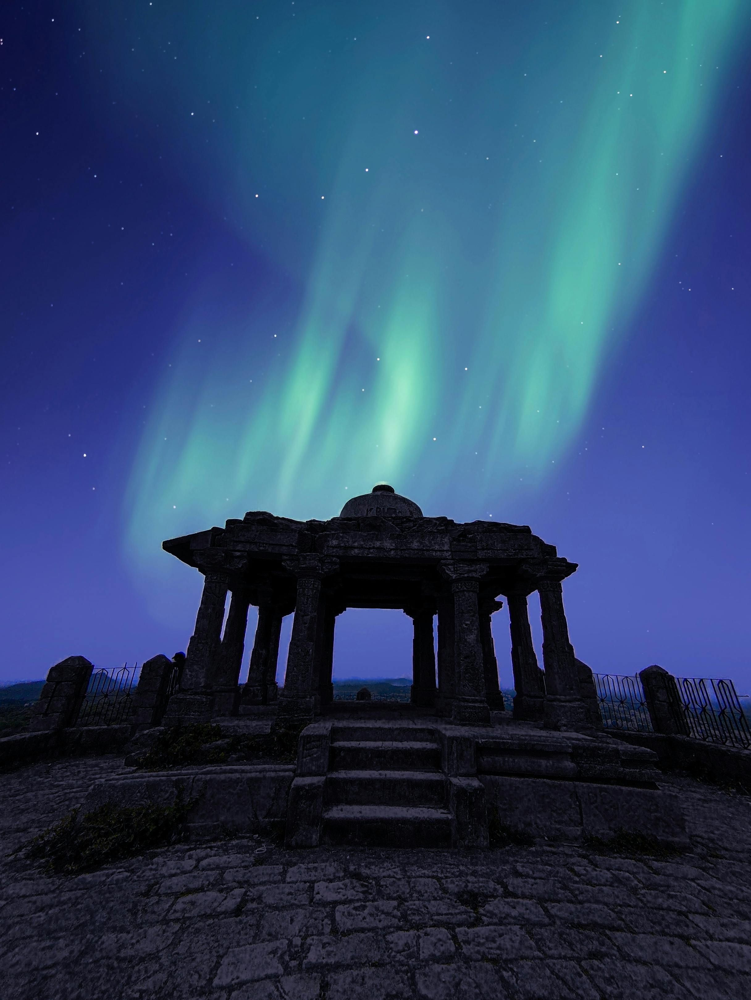
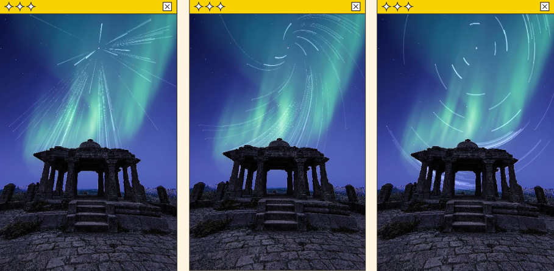
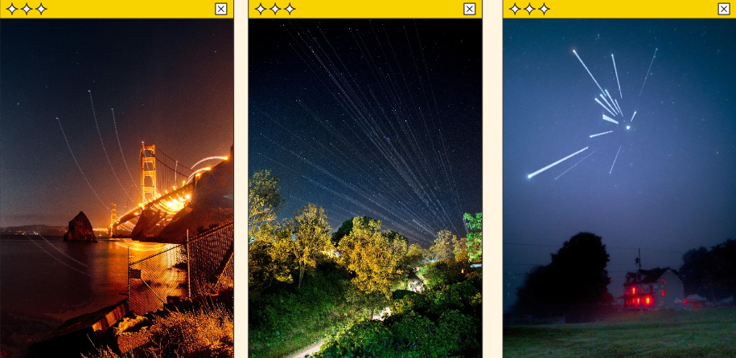
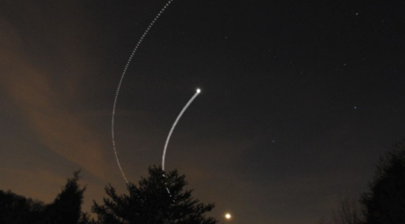
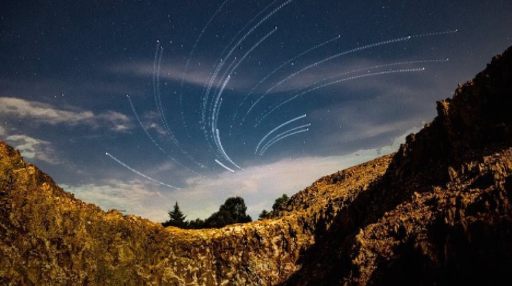
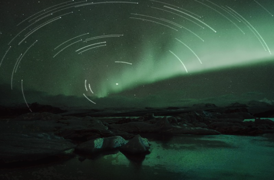
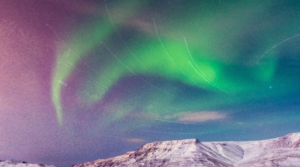

# Star Trails Generator

## Overview

This project aims to generate star trail images from input night sky photographs. The process includes preprocessing, star trail drawing, image composition, and more.

## WorkFlow

|  |

## Features

- Star detection and selection
- Star trail generation
- Foreground-background segmentation
- Foreground enhancement
- Image composition
- User-friendly GUI
- Novel Algorithm combine Guided filter and K-means

## Technology Stack

- C++
- ImageMagick (The final verison doesnt used it)
- QtCreator 6.5.3
- OpenCV 2.4
- async (for multithreading)

## Methodology

1. **Star Detection**: Uses RGB color space with adjustable thresholds.
2. **Star Trail Drawing**: Utilizes OpenCV's `getRotationMatrix2D` function.
3. **Foreground-Background Segmentation**: Implements K-means clustering (K=8) on 9-channel color information.
4. **Foreground Enhancement**: Applies CLAHE for adaptive contrast enhancement.
5. **Image Composition**: Combines enhanced original image with generated star trails.

## GUI Features

- Initial main screen
- BGR adjustment for star detection
- Result display screen
- Exposure time adjustment
- Star trail shape selection
- Save functionality

## Performance

Processing time reduced from 12-27 seconds to 0.2-2.9 seconds for various test images.

## Conclusions

This project presents a novel approach to image segmentation and star trail generation, combining K-means clustering with Sobel gradient processing.

## Future Work

- Enhance universality of K-means algorithm
- Further optimize processing speed
- Improve segmentation accuracy for aurora images

## References

1. [Guide Filter Principles and Applications](https://medium.com/@gary1346aa/%E5%B0%8E%E5%90%91%E6%BF%BE%E6%B3%A2%E7%9A%84%E5%8E%9F%E7%90%86%E4%BB%A5%E5%8F%8A%E5%85%B6%E6%87%89%E7%94%A8-78fdf562e749)
2. [COMP7103 Topic 3](https://www.pseudoyu.com/zh/2021/03/18/comp7103_topic3/)
3. [DBSCAN Algorithm](https://www.baeldung.com/cs/dbscan-algorithm)

## Results Showcase

### Input vs Output Comparison

Here's a comparison between the input image and the generated star trails:

| Input | Output |
|-------|--------|
|  |  |

### More Examples

Here are more examples of generated star trails:

| Example 1 |
|-----------|
|  |

| Example 2 |
|-----------|
|  |

| Example 3 |
|-----------|
|  |

| Example 4 |
|-----------|
|  |

| Example 5 |
|-----------|
|  |

| Example 6 |
|-----------|
|  |
